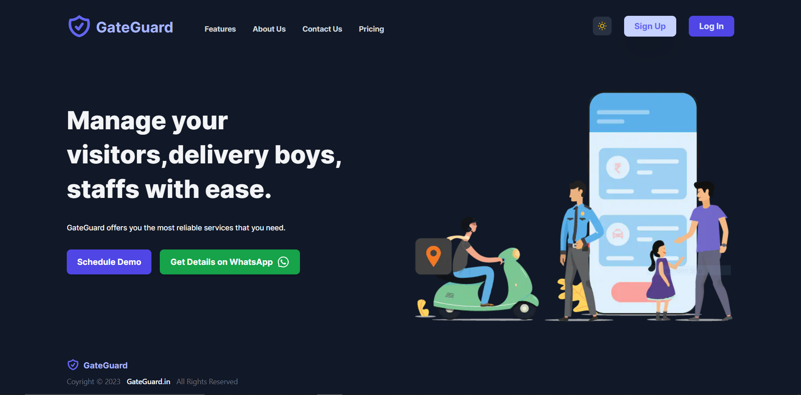

# Visitor Management Sysytem (GateGuard.in) — Dec 2022 - Jan 2023
  
  <!--  -->

### Project Description

** **

[Live Demo URL](https://gateguard.vercel.app)





[Live Demo URL](https://gateguard.vercel.app)


### Project Overview

It consits of :

* Header
* Hero Section
* SignUp Page
* Login Page
* Profile Setting Page
* Dashboard Page
* Society Memeber List Page
* Visitor Management Page
* Domestic Helper Profile Card Page
* Footer
* Dark Mode & Light Mode Functionality
* Mobile App 


and many more components...

### Tech Stack Used

**This is my all-time favorite tech stack:**

- Next.js (Fullstack Framework for React.js)
- React.js (Front-end UI Library)
- Tailwind CSS (CSS Framework)
- AWS Amplify Studio (For Database)
- Vercel (For Hosting the App)
- HTML%, CSS3 , Javascript

### UI-UX Resources Used

* UI Design made using Figma.
* Images - (Google Images).
* SVG Icons - (Hero Icons by Tailwind CSS and React Icons).
* Fonts (Inter, Manrope & Urbanist)- (Google fonts).


### The Code

Steps to run the app locally:


#### Step-1: Git Clone the project

```bash
   git clone 
```

#### Step-2: Install the dependencies

```bash
  npm install
```

#### Step-3: You do need to create Aws Amplify Account and the various Schema Models

 1. Go o aws.amazon.com and Sign Up.
 2. After that, in the search type Amplify Studio and click on it.
 3. Set up Amplify Studio by giving a suitable name for the app and set environment to dev mode.
 4. Then after that you will see something like Launch Amplify Studio. Click on it and proceed.

 After that follow step 4.


#### Step-4: Create Schema Models

 1. I have used (username with email) as a part of AWS Amplify Authentication.

 2. For the Schema Models, here is a screenshot of the Schema Models that I Created.


#### Step-5: Start the development server

Now open your project in your favorite IDE , (VsCode) and then start the development server.

```bash
   npm run dev
```


